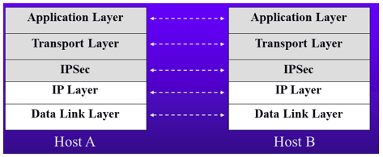
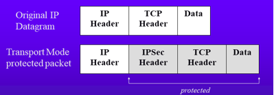
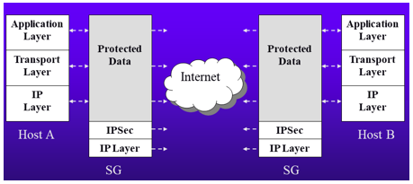
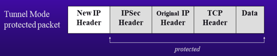

# Tổng quan về IPSec

### Giới thiệu về IPSec
- IPSec (Internet Protocol Security)
- Được phát triển bởi IETF (Internet Engineering Task Force)
- IPSec (Internet Protocol Security) là một bộ giao thức mật mã bảo vệ lưu lượng dữ liệu qua mạng. Hoạt đồng ở Layer 3 (Network Layer) trong mô hình OSI.

**IPSec cung cấp các các khả năng:**
- Xác thực nguồn gốc gói tin
- Kiểm tra tính toàn vẹn gói tin
- Đảm bảo bí mật nội dung thông tin
- Cung cấp khả năng tạo và tự động làm mới key một cách an toàn

IPSec cung cấp một khung an toàn tại Layer3 (Network Layer) của mô hình OSI.

### Khung giao thức IPSec
||Lựa chọn|
|-|-|
|IPSec Protocol|ESP, AH, ESP+AH|
|Encryption (Mã hóa)|DES, 3DES, AES|
|Authentication (Hàm khóa xác thực)|MD5, SHA|
|Diffie-Hellman (giao thức trao đổi khóa)|DH1, DH2|

### Các chế độ hoạt động của IPSec:
IPsec cung cấp an toàn cho 3 tình huống:
- Host-to-host
- Host-to-gateway
- Gateway-to-gateway

**IPSec hoạt động ở 2 chế độ:**
1. Chế độ Transport (chỉ cho "Host-to-host")

    

    

    -> Bảo vệ dữ liệu các lớp trên

2. Chế độ Tunnel (cho cả 3 tình huống trên)

    
    
    **Ghi chú:** **SG** : Security Gateway

    

    -> Bảo về được cả gói tin gốc (gồm dữ liệu các lớp trên và phần Header)

