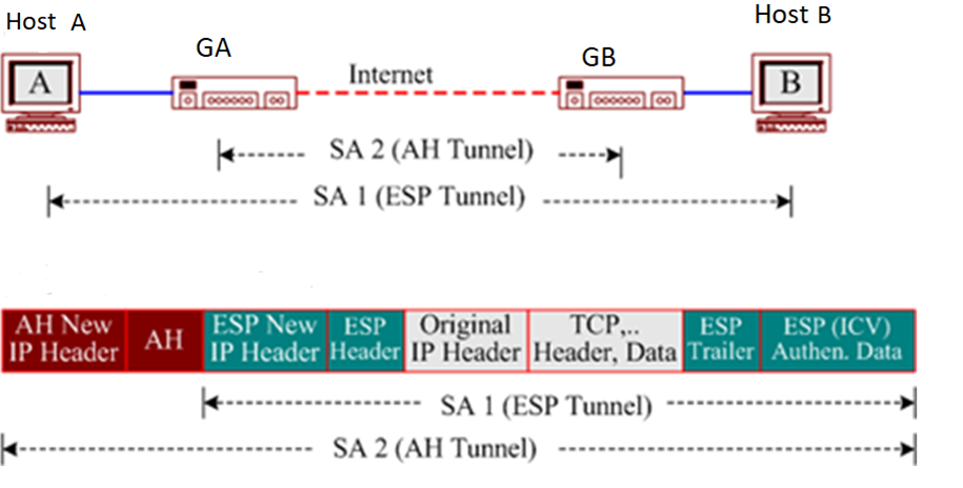

# Tổ hợp an toàn SA

## Khái niệm
SA (Security Assiciation - Đảm bảo an toàn)

SA là tổ hợp các thuật toán và tham số mật mã để bảo vệ lưu lượng mạng. SA là một kết nối logic theo 1 hướng duy nhất giữa hai thực thể sử dụng các dịch vụ IPSec.

## Nội dung của 1 SA
Một IPSec SA gồm các thông tin sau:
- Giao thức an toàn: AH, ESP
- Thuật toán, khóa mật mã: DES, 3DES
- Phương pháp, khóa xác thực cho AH | ESP: Hàm băm(HMAC, MD5, SHA1), chữ ký số (RSA), chứng thư số, Diffiw-Hellman...
- Thông tin liên quan đến khóa: khoảng thời gian thay đổi, khoảng thời gian làm mới
- Thông tin liên quan đến chính SA: địa chỉ nguồn SA, khoảng thời gian làm mới.

## Các thành phần trong 1 SA
Một SA bao gồm 3 thành phần:

Trong SAD (Security Ascociation Database), một SA được xác định bởi:
- **[SPI (Serial Peripheral Interface)](https://vi.wikipedia.org/wiki/Serial_Peripheral_Interface)**: khi xử lý gói tin đến, trong mỗi gói tin IPSec đều chưa SPI của SA cần dùng.

**Hoặc**
- Cặp tham số **IP đích + Giao thức an toàn**: khi xử lý gói tin đi, hai tham số này xác định từ Security Policy

### SPI
- Là một trường 32 bit, dùng để xác định một SA để gắn với một gói dữ liệu
- Là một chỉ số duy nhất cho mỗi bản ghi của cơ sở dữ liệu SADB (giống khóa chính).
- Được định nghĩa bởi người tạo SA, được lựa chọn bởi hệ thống đích khi thương lượng SA
- SPI nhận các giá trị trong khoảng từ [1 … 255]

### Destination IP Address
- Địa chỉ IP của node đích

### Security Protocol
- Mô tả giao thức an toàn IPSec được dùng. Có thể là AH hoặc ESP
- Với 2 điểm liên lạc: cần một SA cho mỗi hướng
- SA có thể cung cấp các dịch vụ an toàn cho 1 phiên VPN (được bảo vệ bởi AH hay ESP). Nếu 1 phiên VPN được bảo vệ kép bởi cả AH và ESP thì mỗi hướng kết nói cần định nghĩa 2 SA.

## Các cơ sở dữ liệu cho SA
Một SA sử dụng 2 cơ sở dữ liệu:
- **SAD - Security Association Database** (Cơ sở dữ liệu tổ hợp an toàn): chứa các SA
    - Duy trì thông tin liên quan đến mỗi SA, bao gồm: các khóa, thuật toán, thời gian có hiệu lực của SA, chuỗi số tuần tự

- **SPD - Security Policy Database** (Cơ sử dữ liệu chính sách an toàn): chứa các SP
    - Lưu các chính sách để thiết lập các SA
    - Duy trì thông tin về các dịch vụ an toàn kèm theo với một danh sách chính sách các điểm vào và ra.

## Quản lý SPD và SAD
- Nội dung của SPD được xác lập (thủ công) bởi quản trị viên và có tính lâu dài.
- Các SA thường được thiết lập thủ công hoặc thương thảo bởi 2 đầu của IPsec và được bổ sung vào SAD mỗi khi thiết lập kết nối IPsec.
- Việc "thương thảo" (negotiate) được thực hiện nhờ giao thức IKE

## Ví dụ về SA Bundle

Trong ví dụ này, sử dụng cả AH và ESP:
- Giữa Host A <-> Host B: ESP Tunnel
- Giữa GA <-> GB: AH tunnel

Với mỗi hướng kết nối từ A->B (hoặc B->A) đều sử dụng 2 SA. Một SA cho AH, một SA cho ESP.

# Tham khảo:
- https://www.forum.vnpro.org/forum/ccnp-security-%C2%AE-ccsp/ccnp-security-new/vpn-aa/420694-kh%C3%A1i-ni%E1%BB%87m-sa-security-association-trong-ipsec