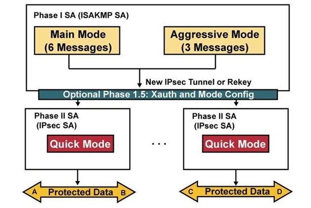
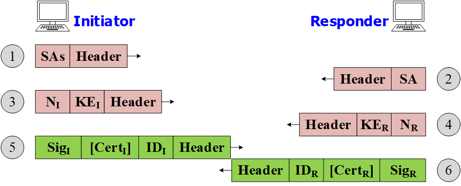
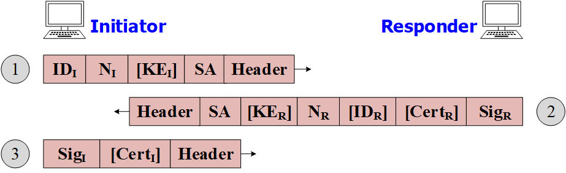
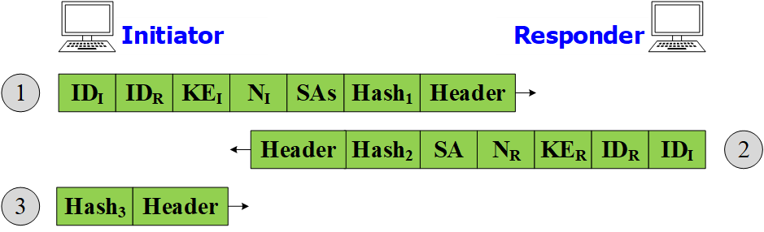
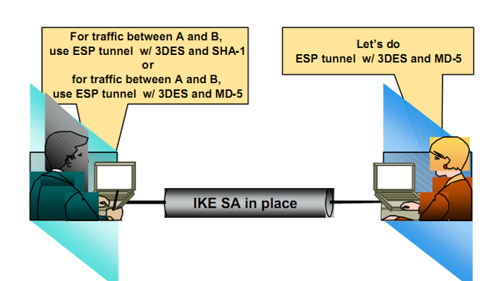

# Giao thức trao đổi khóa IKE

# Giới thiệu
IKE được định nghĩa vào tháng 11 năm 1998 bởi IETF.

Là giao thức thực hiện quá trình trao đổi khóa và thỏa thuận các thông số bảo mật như: 
- Thuật toán mã hóa được áp dụng
- Khoảng thời gian khóa cần được thay đổi.

IKE được dùng để quản lý, trao đổi khóa trong IPSec:
- Thương lượng và tạo tự động các IPSec SA giữa các bên IPSec
- Xóa các khóa, SA khi phiên kết thúc

Bản thân IPSec không có khả năng thiết lập SA. Do đó, quá trình gồm 2 phần:
1. Dùng IKE để thỏa thuận các SA
2. Sử dụng SA để thực thi IPSec

IKE chạy ở cổng UDP 500

**IKE sử dụng 2 giao thức khá để chứng thực đầu cuối và tạo khóa:**
- ISAKMP (Internet Security Association and Key Management Protocol): 
    - Thiết lập 1 phiên an toàn giữa các bên liên lạc IPSec
    - Thương lượng các SA giữa các bên liên lạc IPSec

- Oakley:
    - Xác định cơ chế trao đổi khóa trên phiên IKE
    - Xác định khóa cho AH/ESP một cách tự động cho mỗi IPSec SA
    - Mặc định: sử dụng [Diffe-Hellman](https://vi.wikipedia.org/wiki/Trao_%C4%91%E1%BB%95i_kh%C3%B3a_Diffie-Hellman) để trao đổi khóa

# Mối quan hệ giữa IPSec và IKE
- IPSec cần các SA để bảo vệ lưu lượng
- Nếu chưa có các SA, IPSec sẽ yêu cầu IKE cung cấp các IPSec SA.
- IKE mở một phiên quản lý với các bên tham gia, và thương lượng tất cả các SA và cho IPSec.
- IPSec bắt đầu thực hiện bảo vệ lưu lượng.

# Nhiệm vụ của IKE
- Xác thực 2 chiều
- Thỏa thuận khóa Diffie-Hellman
- Thương thảo thuật toán mật mã
- Thiết lập IPsec SA

# 2 pha của IKE
Giai đoạn hoạt động của IKE cũng được xem tương tự như là quá trình bắt tay trong TCP/IP. Quá trình hoạt động của IKE được chia ra làm 2 phase chính: Phase 1 và Phase 2, cả hai phase này nhằm thiết lập kênh truyền an toàn giữa hai điểm. Ngoài phase 1 và phase 2 còn có phase 1.5

**Sơ đồ hoạt động của IKE:**

## IKE phase 1:
IKE phase 1 đây là giai đoạn bắt buộc phải có. Phase này thực hiện việc xác thực và thỏa thuận các thông số bảo mật, nhằm cung cấp 1 kênh truyền bảo mật giữa 2 đầu cuối. Các thông số sau khi đồng ý giữa 2 bên gọi là SA. SA trong phase này gọi là SA ISAKMP hay SA IKE. Phase này sử dụng 1 trong 2 mode để thiết lập SA: Main mode (Chế độ chính thức) và Aggressive mode (Chế độ tích cực). Các thông số bảo mật bắt buộc phải thỏa thuận trong phase 1 này là:
- Thuật toán mã hóa: DES, 3DES, AES
- Thuật toán hash: MD5, SHA
- Phương pháp xác thực: Preshare-key, SHA
- Nhóm khóa Diffie-Hellman

### Main mode
Main mode sử dụng 6 message để trao đổi thỏa thuận các thông số với nhau:
- 2 message đầu dùng để thỏa thuận các thông số của chính sách bảo mật
- 2 message tiếp trao đổi khóa Diffie-Hellman
- 2 message cuối thực hiện xác thực giữa các thiết bị

*Chú thích:*
- `ID` = Identifier
- `KE` = Key Exchange
- `SA` = Security Association
- `N` = Nonce
- `Cert` = Certificate
- `Sig` = Signature

**Đặc điểm:**
- Trao đổi khóa rồi mới xác thực, giúp che giấu được định danh các bên
- Xác thực bằng PSK hoặc chứng thư số
- Được sử dụng khi mỗi bên đều có IP tĩnh hoặc chứng thư số
- Thường dùng cho **Site-to-Site**

### Aggressive mode
Aggressive mode sử dụng 3 message:
- Message đầu gồm các thông số của chính sách bảo mật, khóa Diffie-Hellman
- Message thứ 2 phàn hồi lại thông số của chính sách bảo mật được chấp nhận, khóa được chấp nhận và xác thực bên nhận
- Message cuối cùng sẽ xác thực bên vừa gửi

**Đặc điểm:**
- Aggressive mode không cho thỏa thuận nhóm DH (g, p)
- Aggressive mode nhanh hơn nhưng không che giấu được định danh của hai bên
- Thường dùng cho **Remote Access VPN - Client to Site**

## IKE phase 2:
IKE phase 2 cũng là phase bắt buộc phải có, đến phase này thì thiết bị đầu cuối đã có đầy đủ các thông số cần thiết cho kênh truyền an toàn. Quá trình thỏa thuận các thông số ở phase 2 là để thiết lập SA IPSec dựa trên nhưng thông số của phase 1.

Quick mode là phương thức được sử dụng trong phase 2. Các thông số mà Quick mode thỏa thuận trong phase 2:
- Giao thức IPSec: ESP hoặc AH.
- IPSec mode: Tunnel hoặc transport.
- IPSec SA lifetime: dùng để thỏa thuận lại SA IPSec sau một khoảng thời gian mặc định hoặc được chỉ định.
- Trao đổi khóa Diffie-Hellman.

### Các bước thực hiện trong Quick Mode
Tất cả các gói tin trong phase 2 được bảo vệ (mã hóa, xác thực) bởi IKE SA sinh ra ở phase 1.

Nhiệm vụ:
- Thương lượng SA
- Rekey hoặc refresh khóa bằng thuật toán DH

**Bước 1: Thương thảo chính sách**
- 1 bên sẽ đưa ra danh sách các giao thức IPSec và các thuật toán. -> Bên nhận sẽ lựa chọn hoặc có yêu cầu khác
- Sau khi thương lượng xong, 2 SA được thiết lập cho mỗi bên:
    - 1 SA cho lưu lượng INBOUND
    - 1 SA cho lưu lượng OUTBOUND

**Bước 2: Key session được làm mới hoặc trao đổi qua Diffie-Hellman**
- Khóa này làm nhiệm vụ: xác thực, toàn vẹn, mã hóa (nếu cần) trong phiên IPSec.
- Có 2 lựa chọn:
    - Làm mới khóa thu được bằng DH trong phase 1
    - Thực hiện trao đỏi khóa DH lần 2, để thu được Ks (rekey)

**Bước 3: Các SA, keys, cùng với SPI được truyền tới IPSec driver**
- Kết quả phase 2:
    - 1 cặp SA mới (inbound và outbound) được dùng để bảo vệ lưu lượng IP
    - Mỗi SA có SPI và key riêng của nó
    - Các khóa mới được tạo cho: xác thực, toàn vẹn hay mã hóa
    - Sau khi cặp SA mới được tạo ra, cặp SA cũ bị xóa và lưu lượng được bảo vệ với cặp SA mới.

**Thương lượng IPSec SA:**

=> Bên gửi đưa ra các lựa chọn về thuật toán, mã hóa. Sau đó, bên nhận sẽ chọn và phản hồi lại cho bên gửi để "chốt"

# Ứng dụng của giao thức IKE
- Sử dụng như 1 phần của bộ giao thức IPSec
- Sử dụng trong các sản phẩm mã nguồn mở:
    - OpenIKEv2
    - StrongSwan
    - Openswan
    - ...