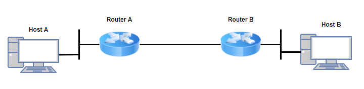
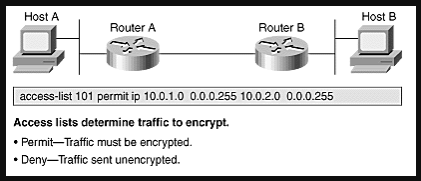
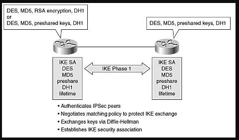
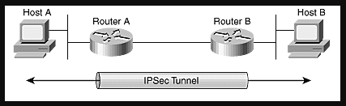
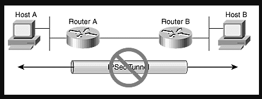

# Cách thức hoạt động của IPSec

Mục đích chính của IPSec là bảo vệ luồng dữ liệu mong muốn dựa trên các dịch vụ bảo mật có sẵn, hoạt động của IPSec có thể chia thành 5 bước chính như sau:



- Host A gửi các traffic cần bảo vệ tới B

- Router A và B thỏa thuận các tham số IKE Phase 1
    ```
    IKE SA  ←   IKE Phase 1 →   IKE SA
    ```

- Router A và B thoả thuận các chính sách IKE Phase 2
    ```
    IPSec SA   ←    IKE Phase 2   →   IPSec SA
    ```

- Thông tin được truyền dẫn qua tunnel IPSec

- Kết thúc tunnel IPSec

**Bước 1:** Traffic cần được bảo vệ khởi tạo quá trình IPSec, Ở đây, các thiết bị đầu cuối IPSec sẽ nhận ra đâu là lưu lượng cần được bảo vệ thông qua trường địa chỉ.



**Bước 2:** IKE Phase 1 - IKE xác thực các bên và 1 tập các cơ chế bảo mật được thỏa thuận và công nhận để thiết lập liên kết giữa IKE SA của mỗi bên. Trong phase này, sẽ thiết lập 1 kênh truyền thông an toàn để tiến hành thỏa thuận IPSec SA trong Phase 2



**Bước 3:** IKE Phase 2 - IKE thỏa thuận các tham số IPSec SA và thiết lập các IPSEC SA tương đương ở 2 phía. Các tham số bảo mật này được sử dụng để bảo vệ dữ liệu và các gói tin trao đổi giữa các điểm đầu cuối. Kết quả cuối cùng của bước 2 và bước 3 là tạo ta 1 kênh thông tin bảo mật giữa 2 bên

**Bước 4:** Truyền dữ liệu - Dữ liệu được truyền giữa các bên IPSec dựa trên cơ sở thông số bảo mật và các khóa lưu trữ trong cơ sở dữ liệu SA



**Bước 5:** Kết thúc tunnel IPSec - Do các IPSec SA hết hạn hoặc bị xóa.



# Tham khảo:
- https://sirpremier.wordpress.com/2012/05/17/giao-thuc-ipsec/
- https://www.ciscopress.com/articles/article.asp?p=24833&seqNum=6