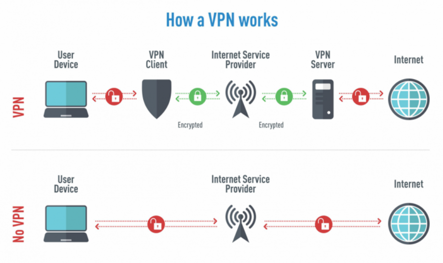

# Tổng quan về VPN

## 1. VPN là gì?
VPN (Virtual Private Network - Mạng riêng ảo) là công nghệ cung cấp cho người dùng khả năng truy cập vào một mạng riêng (LAN) của các máy tính cá nhân và máy chủ trong mạng riêng đó từ một điểm bên ngoài của mạng đó, và không làm ảnh hưởng đến an ninh bảo mật của mạng đó.

Trong thực tế, VPN là 1 mạng dành riêng để kết nối các máy tính với nhau thông qua (thường là) đường truyền Internet, là 1 dịch vụ mạng ảo được triển khai trên Cơ sở hạ tầng của hệ thống mạng công cộng (Internet). VPN được dùng để kết nối các văn phòng, chi nhánh, người dùng làm việc ở xa trụ sở chính. Máy tính thông qua mạng riêng ảo (VPN) sẽ nhìn thấy nhau như 1 mạng LAN.

Để có thể gửi và nhận dữ liệu thông qua mạng công cộng mà vẫn đảm bảo tính an toàn và bảo mật, VPN cung cấp các cơ chế mã hóa dữ liệu trên đường truyền tạo ra một đường ống bảo mật giữa nơi nhận và nơi gửi gọi là Tunnel. Tunnel giống như một kết nối point-to-point trên mạng riêng.

Để có thể tạo ra một đường ống bảo mật đó, dữ liệu phải được mã hóa theo cơ chế giấu đi, chỉ cung cấp phần đầu gói tin (header) là thông tin về đường đi cho phép nó có thể đi tới đích thông qua mạng công cộng một cách nhanh chóng, dữ liệu được mã hóa để nếu các packet bị bắt trên đường truyền công cộng cũng không thể đọc nội dung vì không có khóa để giải mã. Liên kết với dữ liệu mã hóa và đóng gói được gọi kết nối VPN.

## 2. Chức năng của VPN
- **Truy cập vào mạng nội bộ doanh nghiệp khi ở xa:** VPN thường được sử dụng bởi những người kinh doanh để truy cập vào mạng lưới kinh doanh của họ, bao gồm tất cả tài nguyên trên mạng cục bộ, trong khi đang đi trên đường, đi du lịch,... Các tài nguyên trong mạng nội bộ không cần phải tiếp xúc trực tiếp với Internet, nhờ đó làm tăng tính bảo mật.
- **Truy cập mạng gia đình (home network), dù không ở nhà:** Bạn có thể thiết lập VPN riêng để truy cập khi không ở nhà. Thao tác này sẽ cho phép truy cập Windows từ xa thông qua Internet, sử dụng tập tin được chia sẻ trong mạng nội bộ, chơi game trên máy tính qua Internet giống như đang ở trong cùng mạng LAN.
- **Duyệt web ẩn danh:** Nếu đang sử dụng WiFi công cộng, duyệt web trên những trang web không phải https, thì tính an toàn của dữ liệu trao đổi trong mạng sẽ dễ bị lộ. Nếu muốn ẩn hoạt động duyệt web của mình để dữ liệu được bảo mật hơn thì bạn nên kết nối VPN. Mọi thông tin truyền qua mạng lúc này sẽ được mã hóa.
- **Truy cập đến các trang web bị chặn:** Bỏ qua kiểm duyệt internet, tường lửa,...
- **Tải tập tin:** Tải BitTorrent trên VPN sẽ giúp tăng tốc độ tải file. Điều này cũng có ích với các traffic mà ISP của bạn có thể gây trở ngại.

