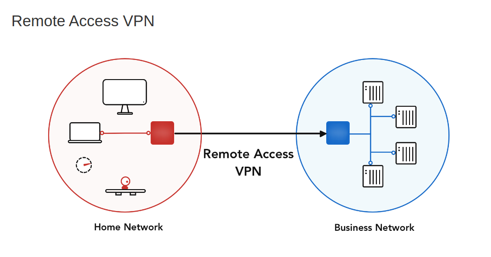
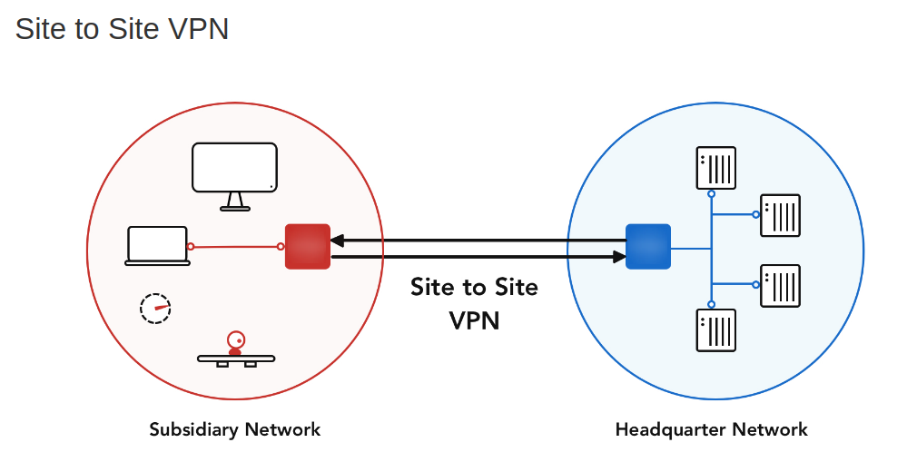

# Phân loại VPN

VPN là khái niệm chung cho việc thiết lập kênh truyền ảo, nhưng còn tùy thuộc vào mô hình mạng và nhu cầu sử dụng mà chọn loại thiết kế cho phù hợp. Công nghệ VPN có thể được phân thành 2 loại cơ bản: 
- Remote Access VPN (Client to site)
- Site-to-Site VPN

## 1. Client to site - Remote access VPN
Client to site (Remote access VPN) cho phép người dùng sử dụng các thiết bị cá nhân (máy tính, điện thoại,...) truy cập đến một mạng nội bộ để kết nối đến các tài nguyên của 1 tổ chức, doanh nghiệp

Loại này mô tả việc người dùng ở xa sử dụng các phần mềm VPN để truy cập vào mạng Intranet của công ty thông qua gateway hoặc VPN concentrator (bản chất là 1 server). Vì vậy, giải pháp này thường được gọi là client/server.

Loại này thường áp dụng cho nhân viên làm việc lưu động hay làm việc ở nhà muốn kết nối vào mạng công ty một cách an toàn. Cũng có thể áp dụng cho văn phòng nhỏ ở xa kết nối vào Văn phòng trung tâm của công ty.

## 2. Site to site 
Site to site VPN là mô hình dùng để kết nối các hệ thống mạng ở các nơi khác nhau tạo thành một hệ thống mạng thống nhất. Ở loại kết nối này thì việc chứng thực ban đầu phụ thuộc vào thiết bị đầu cuối ở các Site, các thiết bị này hoạt động như Gateway và đây là nơi đặt nhiều chính sách bảo mật nhằm truyền dữ liệu một cách an toàn giữa các Site.

Trong VPN site-to-site, các host cuối không biết về kết nối VPN, chúng vẫn gửi và nhận lưu lượng TCP/IP bình thường thông qua một 'gateway' VPN. Cổng VPN có trách nhiệm đóng gói và mã hóa lưu lượng đi ra cho tất cả lưu lượng truy cập từ một trang web cụ thể. Sau đó VPN gateway sẽ gửi nó qua một đường hầm VPN qua Internet tới một cổng VPN ngang hàng tại địa điểm mục tiêu. Khi nhận được, cổng VPN ngang hàng giải tiêu đề, giải mã nội dung và chuyển tiếp gói tin tới máy chủ đích bên trong mạng riêng của nó.

VPN site-to-site có thể được sử dụng khi muốn kết nối 2 site của cùng một công ty ( 2 văn phòng với nhau). Lúc này, mọi nhân viên, thiết bị ở cả 2 văn phòng có thể trao đổi mọi thông tin với nhau thông qua kết nối VPN

