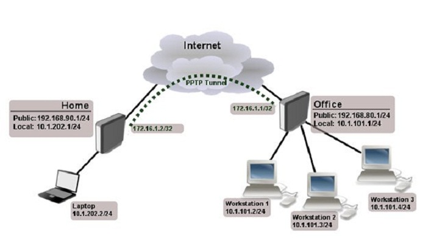
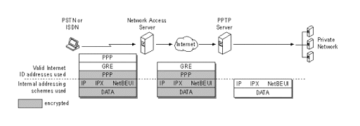

# PPTP - Point-to-Point Tunneling Protocol

Hoạt động ở Layer 2 của mô hình OSI (Data Link) - Dữ liệu dạng Frame

## Lịch sử:
- Ra đời năm 1995
- Phát triển bởi Microsoft, Ascend Communications (1 phần của Nokia hiện nay), 3Com, và 1 số tập đoàn khác.

## Phương thức mã hóa, chuẩn xác thực
### Mã hóa
- PPTP không chỉ định giao thức mã hóa nhưng có thể sử dụng 1 số giao thức như: **MPPE - 128 bits** (Microsoft Point-to-Point Encryption)
- PPTP chỉ có thể sử dụng tiêu chuẩn mã hóa mạnh nhất mà cả 2 phía cùng hỗ trợ. Nếu một phía chỉ hỗ trợ tiêu chuẩn yếu hơn thì kết nối phải sử dụng mã hóa yếu hơn người dùng mong đợi.

### Xác thực
- Chuẩn xác thực: Sử dụng chuẩn xác thực **MS_CHAP v2** (128 bits)

## Đóng gói dữ liệu
- PPTP sử dụng GRE (General Routing Encapsulation) 
- Port: TCP port 1723, và IP port 47 (47 là tên giao thức, không phải số hiệu cổng)

## Tunneling modes:
Giao thức hỗ trợ 2 loại tunnel:
- **Voluntary Tunneling**: Một loại tunneling được khởi tạo bởi client trên một kết nối hiện có với server.
- **Compulsory Tunneling**: Một loại tunneling được khởi tạo bởi PPTP server tại ISP, yêu cầu server truy cập từ xa để tạo tunnel.

## Cách hoạt động của PPTP
- Client thiết lập 1 kênh kết nối (được gọi là tunnel) tới PPTP server qua cổng TCP 1723
- Client sử dụng kênh dữ liệu GRE (giao thức 47) đóng gói dữ liệu và gửi tới PPTP server.
- PPTP xác thực gói tin, giải mã và gửi tới đích

## Kiến trúc công nghệ
PTPT hoạt động ở Layer 2 của mô hình OSI (Data Link) - Dữ liệu dạng Frame. Nó được thiết kế để kết nối trực tiếp 2 bộ định tuyến.

## Usecase sử dụng
Khi nhu cầu người dùng cần tốc độ truyền tải nhanh, không quá quan trọng đến bảo mật.

- Làm VPN để truy cập hoặc phát trực tuyến (streaming) tới nội dung trên mạng bị chặn theo địa lý

# Tham khảo:
- https://www.cactusvpn.com/beginners-guide-to-vpn/what-is-pptp/
- http://wwwdisc.chimica.unipd.it/luigino.feltre/pubblica/unix/winnt_doc/pppt/understanding_pptp.html
- https://dzone.com/articles/the-four-most-common-vpn-protocols-explained-and-c