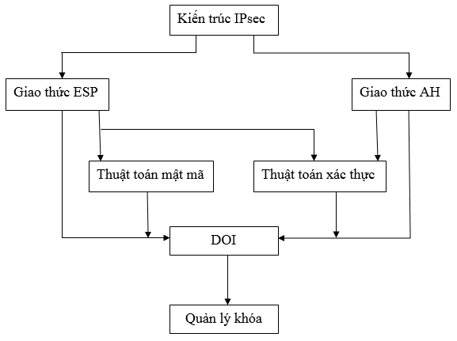
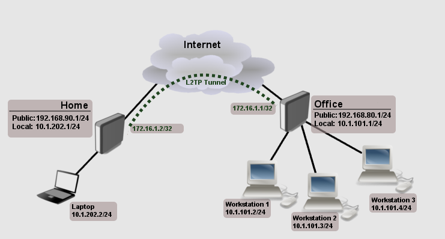

# L2TP/IPSec - (Layer 2 Tunnel Protocol)

## Lịch sử
- Xuất hiện lần đầu vào năm 1999
- L2TP là sự kết hợp của PPTP và L2F
- PPTP do Microsoft đưa ra còn L2F do Cisco khởi xướng. 2 công ty này đã hợp tác cùng kết hợp 2 giao thức lại.

## L2TP là gì?
- L2TP là giao thức tunnel (đường hầm), nó sử dụng header để đóng gói rieeg cho việc truyền các gói ở lớp 2.
- L2TP không phụ thuộc vào IP và GRE nên nó có thể làm việc ở môi trường vật lý khác. 

## IPSec là gì?
Để thiết lập tính bảo mật trong IP ở cấp độ gói, IETF (Internet Engineering Task Force - Tổ chức chuyên trách về kỹ thuật Internet) đã đưa ra họ giao thức IPSec.

IPSec (Internet Protocol Security) là một bộ giao thức mật mã bảo vệ lưu lượng dữ liệu qua mạng. Hoạt đồng ở Layer 3 (Network Layer) trong mô hình OSI.

## Mã hóa, chuẩn xác thực
- Sử dụng IPSec để mã hóa dữ liệu. IPSec sử dụng 1 thuật toán băm (MD5, SHA-1, ...) để đảm bảo dữ liệu không bị can thiệp vào. 
- Thuật toán mã hóa IPSec sử dụng: DES, 3DES, ...

- Port sử dụng: L2TP sử dụng port 1701. Khi ghép với IPSec, nó sử dụng thêm cổng UDP 500 (cho IKE), 4500 (cho NAT) và 1701 (cho lưu lượng L2TP)

**IPSec cung cấp các các khả năng:**
- Xác thực nguồn gốc gói tin
- Kiểm tra tính toàn vẹn gói tin
- Đảm bảo bí mật nội dung thông tin
- Cung cấp khả năng tạo và tự động làm mới key một cách an toàn

## Cách hoạt động:
- L2TP Tunneling bắt đầu bằng cách kết nối LAC (L2TP Access Concentrator) và LNS (L2TP Network Server) - hai điểm cuối của giao thức - trên Internet. 
- Sau khi đạt được điều đó, một layer liên kết PPP được kích hoạt và đóng gói lại, sau đó, lớp liên kết này được chuyển qua web.
- kết nối PPP được khởi tạo bởi người dùng cuối (bạn) với ISP. Khi LAC chấp nhận kết nối, liên kết PPP được thiết lập. Sau đó, một vị trí trống trong tunnel mạng được chỉ định và yêu cầu sau đó được chuyển đến LNS.
- Cuối cùng, khi kết nối được xác thực và chấp nhận hoàn toàn, một giao diện PPP ảo sẽ được tạo. Tại thời điểm đó, các link frame (đơn vị truyền dữ liệu số trong mạng máy tính) có thể tự do đi qua tunnel. Các frame được LNS chấp nhận, sau đó loại bỏ mã hóa L2TP và tiến hành xử lý chúng như các frame thông thường

## Kiến trúc công nghệ
**IPSec:**

Mô hình VPN L2TP/IPSec:

## Usecase sử dụng
- Kết nối tới một mạng nội bộ và yêu cầu tính bảo mật và quá trình cấu hình không quá phức tạp.

# Tham khảo:
- https://vnpro.vn/thu-vien/giao-thuc-duong-ham-lop-2-l2tp-va-giao-thuc-bao-mat-ip-ipsec-trong-vpn-2362.html